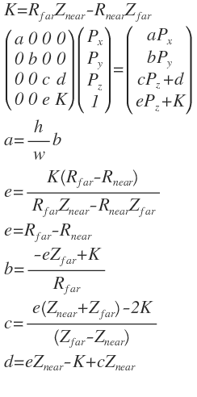
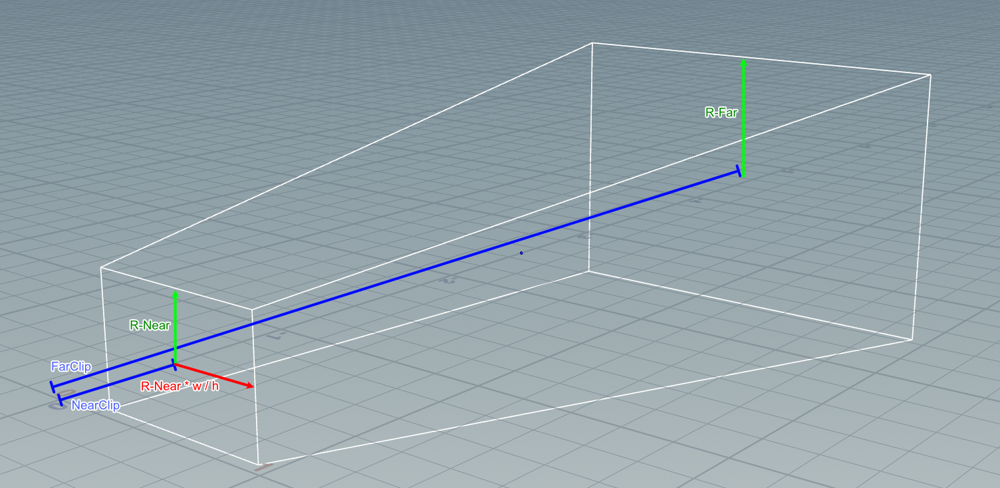

## Generized Perspective
Perspective-Ortho-ReversePerspective seamless transition.

## demo

## The Projection Matrix

<!--

 K=R_{ far }Z_{ near }-R_{ near }Z_{ far }\\ \begin{pmatrix} a & 0 & 0 & 0 \\ 0 & b & 0 & 0 \\ 0 & 0 & c & d \\ 0 & 0 & e & K \end{pmatrix}\begin{pmatrix} P_{ x } \\ P_{ y } \\ P_{ z } \\ 1 \end{pmatrix}=\begin{pmatrix} aP_{ x } \\ bP_{ y } \\ cP_{ z }+d \\ eP_{ z }+K \end{pmatrix}\\ a=\frac { h }{ w } b\\ e=\frac { K\left( R_{ far }-R_{ near } \right)  }{ R_{ far }Z_{ near }-R_{ near }Z_{ far } } \\ e=R_{ far }-R_{ near }\\ b=\frac { -eZ_{ far }+K }{ R_{ far } } \\ c=\frac { e\left( Z_{ near }+Z_{ far } \right) -2K }{ \left( Z_{ far }-Z_{ near } \right)  } \\ d=eZ_{ near }-K+cZ_{ near }\\ 

 -->

 

